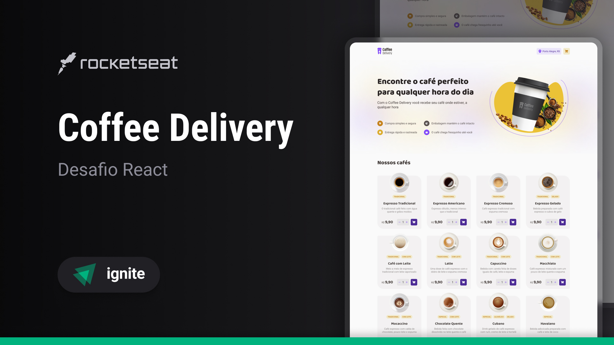

# Coffee Delivery (pt-BR)
[](#)
***Coffee Delivery é um ecommerce de cafés***

**Coffee Delivery** é uma página web de catálogo e compra de cafés. Esse projeto é um dos desafios da trilha de **React** do Ignite, o bootcamp completo de especialização em React, React Native e Node.js da Rocketseat.

> Status: Finished... ✅

## Tecnologias 🚀


## Bibliotecas 📕

📑 **REACT HOOK FORM**

📑 **ZOD**

📑 **IMMER**

📑 **PHOSPHOR ICONS**

📑 **ESLINT**

📑 **TAILWIND MERGE**

## Funcionalidades 💡

✅ **ADICIONAR CAFES DO CARRINHO**

✅ **REMOVER CAFES DO CARRINHO**

## Como utilizar o projeto ⚙️

### 1. Clone o repositório
```sh
git clone https://github.com/reinheimermat/coffee-delivery
```
### 2. Instale as dependências
```sh
npm install
```

### 3. Rode o projeto local
```sh
npm run dev
```
### 4. Acesse o projeto
```sh
http://localhost:5173/
```

## Licença 📝

[](https://github.com/Ileriayo/markdown-badges/blob/master/LICENSE)

## Links 🔗

[](https://www.linkedin.com/in/reinheimermat/)
[](mailto:contatoreinheimer@gmail.com)